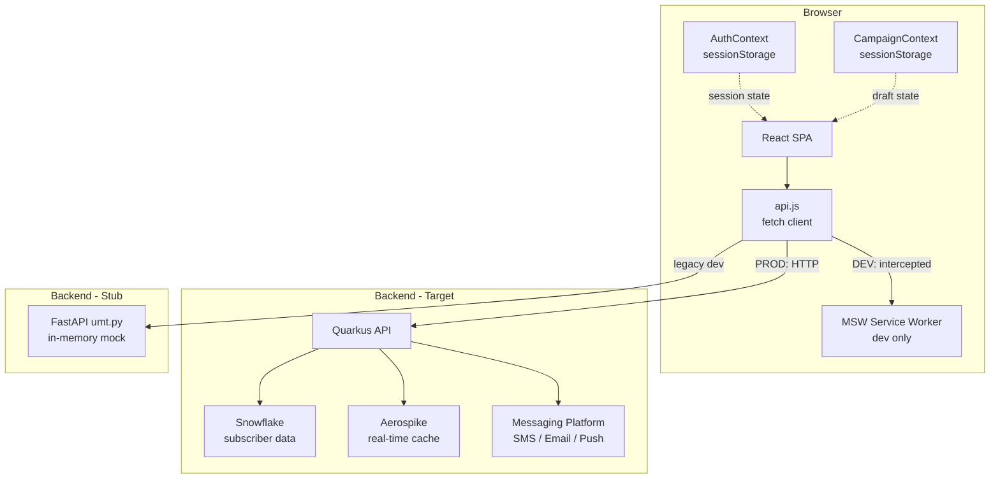

# Architecture

## Tech Stack

| Layer | Technology | Notes |
|-------|-----------|-------|
| Frontend | React 19 + Vite 8 | SPA, no SSR |
| Routing | React Router v6 | Client-side, hash-free URLs |
| Styling | Plain CSS (`global.css`) | No CSS framework |
| Date/time picker | Flatpickr | Used in Schedule step |
| HTTP mocking | MSW v2 | Dev-only, browser service worker |
| Backend (stub) | FastAPI (Python) | Being replaced by Quarkus |
| Backend (target) | Quarkus (Java) | Connects to Snowflake + Aerospike |
| Data warehouse | Snowflake | Subscriber base for audience queries |
| Cache/messaging | Aerospike | Real-time subscriber data |

---

## Layer Diagram



---

## Frontend Architecture

### Entry Point

`main.jsx` conditionally starts MSW before mounting React:

```
main.jsx
  ├─ [DEV] import('./mocks/browser').then(w => w.start())
  └─ ReactDOM.render(<App />)
```

### Provider Tree

```
AuthProvider          ← manages user session
  └─ CampaignProvider ← manages multi-step campaign draft
       └─ BrowserRouter
            └─ Routes
```

### Route Structure

| Path | Component | Auth |
|------|-----------|------|
| `/login` | `Login` | Public |
| `/dashboard` | `Dashboard` | Protected |
| `/campaigns` | `Campaigns` | Protected |
| `/campaign-creation` | `CampaignCreation` | Protected |
| `/audience-builder` | `AudienceBuilder` | Protected |
| `/message` | `Message` | Protected |
| `/schedule` | `Schedule` | Protected |
| `/review` | `Review` | Protected |
| `*` | Redirect to `/login` | — |

`ProtectedRoute` reads from `AuthContext`. If `user` is `null`, it redirects to `/login`. If `user` is `undefined` (loading), it renders nothing.

### State Management

Two React contexts handle all app state:

**AuthContext**
- Checks `sessionStorage` on mount (survives page reload)
- Falls back to `GET /api/me` if no session stored
- Persists login state to `sessionStorage` under key `umt_auth`

**CampaignContext**
- Accumulates draft across 5 wizard steps
- Persists entire draft to `sessionStorage` under key `umt_campaign_draft`
- `resetDraft()` is called when "+ New Campaign" is clicked — ensures a clean slate

### API Client (`api.js`)

All HTTP calls go through a single `request()` function. It:
- Prepends `VITE_API_URL` (empty string by default — works with Vite dev proxy)
- Sets `Content-Type: application/json` when a body is present
- Throws a typed error with `.status` for non-2xx responses

---

## Campaign Creation Flow

```
Dashboard  →  /campaign-creation  →  /audience-builder  →  /message  →  /schedule  →  /review  →  POST /api/campaigns
    │               Step 1                  Step 2           Step 3       Step 4        Step 5
    │
    └─ resetDraft() called on "+ New Campaign" click
```

Each step:
1. Pre-fills from `draft.[step]` so the user can navigate back without losing data
2. Calls `set[Step](data)` before navigating forward (or on "Save for Later")
3. Shows a disabled-state tooltip on the Next button when required fields are missing

**StepBar** reads completion state from `draft` directly — a step shows a green checkmark (✓) if its data exists in the draft and is clickable for backward navigation.

---

## MSW Mock Layer

```
Browser request: GET /api/campaigns
        ↓
Service Worker (public/mockServiceWorker.js)
        ↓
handlers.js: http.get('/api/campaigns', ...)
        ↓
Returns: { campaigns: [...] }
        ↓
React component receives data
```

MSW is loaded only when `import.meta.env.DEV === true`. Production builds never include it. Switching to the real Quarkus API requires only setting `VITE_API_URL` — no application code changes are needed.

---

## Backend Stub (`umt.py`)

The FastAPI server is a legacy dev server kept for reference and testing. It:
- Holds campaign data in-memory (no database)
- Uses `SessionMiddleware` for cookie-based auth
- Has stub routes for `POST /api/campaigns` and `POST /api/audience/estimate` with `# TODO` comments marking what the Quarkus team needs to implement

It is **not** used in the normal dev workflow (MSW handles that) but can be started manually for API contract testing.

---

## Key Request Flows

### Login

```
Login form → api.login(email, password)
           → POST /api/login
           → { ok: true, email }
           → AuthContext stores user in state + sessionStorage
           → navigate('/dashboard')
```

### Create Campaign (Submit)

```
Review page → api.createCampaign(draft)
           → POST /api/campaigns
           → Body: { details, audience, message, schedule }
           → { ok: true, id, status: 'queued' }
           → resetDraft()
           → Modal: "Campaign for Review"
           → navigate('/dashboard')
```

### Audience Estimate

```
AudienceBuilder → "Count Audience" button click
               → api.estimateAudience({ brands, groups })
               → POST /api/audience/estimate
               → { count: number }
               → Display count in header
               → Falls back to formula if request fails
```
